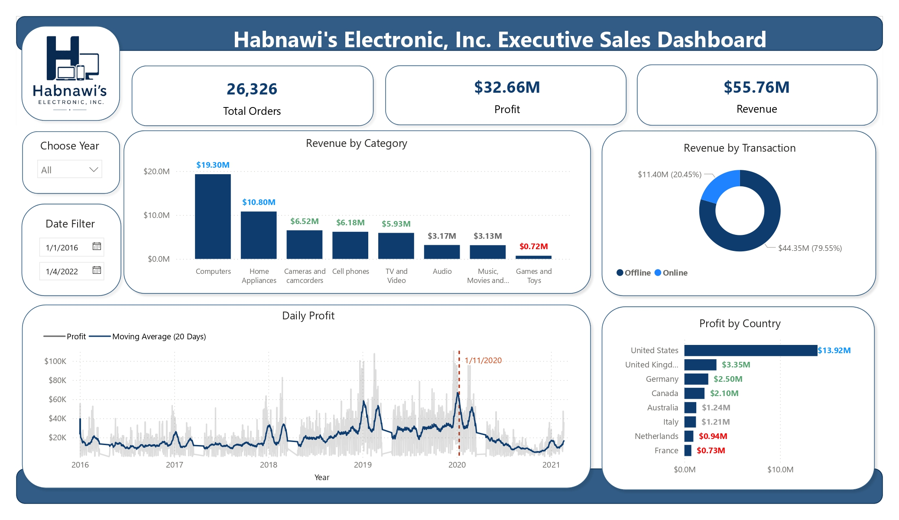

# 📊 Habnawi's Electronic, Inc. — Sales Performance Dashboard

> This project demonstrates an end-to-end **Data Analytics and Business Intelligence workflow**, starting from data preparation and data modeling to visualization and business insight generation.

---

## 1. Business Understanding
### 1.1 Business Background

**Habnawi's Electronic, Inc.** is a fictional electronics retail company specializing in the sale of various electronic products and technology devices for home, office, and entertainment needs. The company offers a wide range of product categories, such as laptops, smartphones, televisions, computers, accessories, and home appliances from various renowned brands.

Over the past few years, the company has experienced an increase in the number of transactions; however, management still lacks a comprehensive overview of the factors that contribute most significantly to the company's revenue and profit.

---

### 1.2 Bussiness Problem

Management seeks to identify top-performing product categories, the effectiveness of individual sales channels, profit trends over time, and the countries contributing the highest profits. This information is essential for supporting strategic decision-making regarding product management, marketing, market expansion, and profitability enhancement.
To address these needs, an Executive Sales Dashboard has been developed; it presents Key Performance Indicators (KPIs) and interactive visualizations, enabling management to monitor business performance rapidly and on a data-driven basis.

---

### 1.3 Project Objectives

This project aims to develop an interactive dashboard that allows stakeholders to monitor business performance and explore sales patterns through data.

The dashboard provides management-level insights into:

- Overall sales performance
- Revenue and profitability
- Product category performance
- Online vs. offline sales contribution
- Profit trends over time
- Geographic profitability
- Performance across different time periods

---

### 1.4 Bussiness Questions

The analysis was designed to answer the following questions:

1. Overall Performance

- What are the company's total Revenue, Profit, and Orders?
- How does overall business performance change over time?

2. Product Performance

- Which product categories generate the highest revenue?
- Which categories contribute the least revenue?
- How is revenue distributed across product categories?

3. Sales Channel

- How much revenue is generated through Online and Offline transactions?
- What is the contribution of each sales channel to total revenue?

4. Time Analysis

- How does daily profit change over time?
- Are there periods with significant increases or decreases in profit?
- How does the moving average help identify the underlying profit trend?

5. Geographic Performance

- Which countries contribute the most profit?
- How is profit distributed across different countries?

---

## 2. Dataset Overview

This project uses an open source datasets that represents an electronic retail company. The datasets contains 3 main part with different file extension, Sales.csv, Product.txt, and Country.txt.


---

## 3. Tech Stack

## 4. Data Preparations

Raw data was prepared using **Power Query** in **Power BI** to ensure data quality and consistency before the analysis and visualization stages.

The data preparation process included:
- Data type validation - ensuring dates, numerical values, and categorical fields assigned appropriate data types.
- Data cleaning - identifying and handling missing, inconsistent, or invalid values.
- Column transformation - formatting and transforming existing fields to make them suitable for analysis.
- Data standardization - ensuring consistent values across categorical fields such as product categories, sales channels, and countries.
- Data validation - checking the transformed dataset to ensure that the resulting data was consistent and ready for modeling.
- Data preperation for modeling - structuring the cleaned dataset as the foundation for the subsequent data modeling and dashboard development stages.

For **Country** dataset, since it is in a .txt file without delimiters, it must first be converted using **Python** before undergoing data cleaning with **Power Query**.
This is the code to convert the **Country** dataset from .txt file to csv file:

```python
import pandas as pd

def preprocess():
    with open(file) as file:
        content = file.readlines()

    content = [line.strip() for line in content]
    content = [line.split() for line in content]

    storekeys = [line[0] for line in content][1:]

    countries = [
        " ".join(line[1:3])
        if line[1]  == "United" else line[1] 
        for line in content
        ][1:]

    states = [
        " ".join(line[3:])
        if line[1]  == "United" else " ".join(line[2:]) 
        for line in content
        ][1:]

    data = {
        "id":storekeys,
        "country": countries,
        "states": states
    }

    df = pd.DataFrame(data)
    df.to_csv("store.csv", index=False)
```
---

## 5. Data Modeling

The dataset was structured using a **dimensional data model** based on the **Star Schema** approach in Power BI. The model separates transactional data from descriptive attributes, allowing the dashboard to perform analysis across different business dimensions such as products, stores, and time.

The data model consists of:

- **Fact Table:** `Sales`
- **Dimension Tables:** `Products`, `Store`, and `Calendar`
- **Measure Table:** `Measure`


---

### 5.1 Fact Table - Sales
The **Sales** table serves as the central fact table of the model. It contains transactional-level sales records and the foreign keys required to connect each transaction to the corresponding dimensions.

| Column          | Description                                                  |
| --------------- | ------------------------------------------------------------ |
| `Sales Key`     | Unique identifier for each sales record                      |
| `Order Number`  | Identifier of the customer order                             |
| `Line Item`     | Identifies individual line items within an order             |
| `Order Date`    | Date when the order was placed                               |
| `Delivery Date` | Date when the order was delivered                            |
| `CustomerKey`   | Identifier linking sales transactions to customers           |
| `ProductKey`    | Foreign key linking transactions to the `Products` dimension |
| `StoreKey`      | Foreign key linking transactions to the `Store` dimension    |
| `Quantity`      | Number of products sold                                      |
| `Currency Code` | Currency associated with the transaction                     |

The Sales table acts as the many-side (*) of the relationships with the dimension tables because multiple sales transactions can belong to the same product, store, or date.

---

### 5.2 Dimension Table
#### 5.2.1 Products
The Products table contains descriptive information about the products sold by the company.
Important attributes include:

- ProductKey
- Product Name
- Brand
- Category
- CategoryKey
- Subcategory
- SubcategoryKey
- Color
- Unit Cost USD
- Unit Price USD

This dimension enables product-oriented analysis, such as:

- Revenue by category
- Revenue by product
- Revenue by brand
- Product performance
- Profitability by category or subcategory

Using a separate product dimension also prevents repetitive product descriptions from being stored in every transactional record.

---

#### 5.2.2 Store

The Store table contains descriptive information about the store or sales location associated with each transaction.

The table contains attributes such as:

- id
- country
- states
- IsOnline

These attributes allow the dashboard to analyze sales performance across different geographical and sales-channel dimensions.

For example, the IsOnline attribute can be used to distinguish between online and offline transactions, while country and states support geographical analysis.

---

#### 5.2.3 Calendar

The Calendar table serves as the date dimension of the model. Rather than relying directly on the date column in the Sales fact table for time-based analysis, a dedicated calendar table provides a consistent structure for temporal analysis and Power BI time-intelligence calculations.

The table contains fields such as:

- Date
- Day Name
- Month Name
- Quarter
- Week of Month
- Week of Year
- Year

---

### 5.3 Measure Table

The Measure table is a dedicated table used to organize and store DAX measures separately from the underlying data tables.

The current model contains measures such as:

- Revenue
```DAX
Revenue = SUMX(Sales, Sales[Quantity] * RELATED(Products[Unit Price USD]))
```
- Profit
```DAX
Profit = SUMX(Sales, Sales[Quantity] * (RELATED(Products[Unit Price USD]) - RELATED(Products[Unit Cost USD])))
```
- Moving Average (25 Days)
```DAX
Moving Average (25 Days) = 
AVERAGEX(
    DATESINPERIOD(
        'Calendar'[Date],
        MAX('Calendar'[Date]),
        -25,
        DAY
    ),
    [Profit]
)
```

These measures are not stored as physical columns in the transactional data. Instead, they are calculated dynamically using DAX based on the current filter context.

---

### 5.4 Relationships

The model uses one-to-many (1:*) relationships, where dimension tables represent the "one" side and the Sales fact table represents the "many" side.

| Dimension  | Key          | Fact Table Key | Cardinality | Purpose                       |
| ---------- | ------------ | -------------- | ----------- | ----------------------------- |
| `Store`    | `id`         | `StoreKey`     | 1:*         | Store & geographical analysis |
| `Products` | `ProductKey` | `ProductKey`   | 1:*         | Product analysis              |
| `Calendar` | `Date`       | `Order Date`   | 1:*         | Time-based analysis           |

---

## 6. Data Extraction & Feature Engineering

## 7. Key Findings

### **Finding 1 - Revenue is strongly concentrated in a small number of product categories**

**Insight:**
`Computers` is the largest revenue contributor at **$19.30M (34.6%)**, followed by `Home Appliances` at **$10.80M (19.4%)**. Together, these two categories account for approximately **54%** of total revenue, indicating that overall sales performance is highly influenced by their performance. Meanwhile, `Cameras and camcorders`, `Cell phones`, and `TV and Video` each contribute approximately **10–12%**, providing additional but smaller revenue streams. At the lower end, Games and Toys contributes only **1.3%**, making it the smallest revenue-generating category.

Profit margins across product categories range from **54.73% to 60.98%**, indicating relatively consistent profitability across the portfolio. `Music, Movies and Audio Books` records the highest margin at **60.98%**, followed by `Cameras and camcorders` at **60.12%** and `TV and Video` at **59.65%**. Meanwhile, `Games and Toys` has the lowest margin at **54.73%**.

**Why it matters**: 

The revenue distribution suggests that management should simultaneously protect the performance of the company's major revenue drivers while investigating growth opportunities and underlying performance factors in lower-contributing categories.

However, the category with the highest profit margin is not necessarily the category generating the highest absolute profit. `Computers`, for example, has a lower margin of **58.43%**, but its significantly larger revenue base results in an estimated profit of approximately **$11.28M**, making it the largest profit contributor.


The analysis suggests two distinct business considerations: protecting high-revenue categories such as **Computers and Home Appliances**, which have a substantial impact on total profit, while also investigating higher-margin categories such as **Music, Movies and Audio Books** and **Cameras and camcorders** for potential revenue growth opportunities.

## 8. Dashboard Overview



## 9. Insights & Strategic Recommendations

## 10. Limitations & Methodology Notes

---