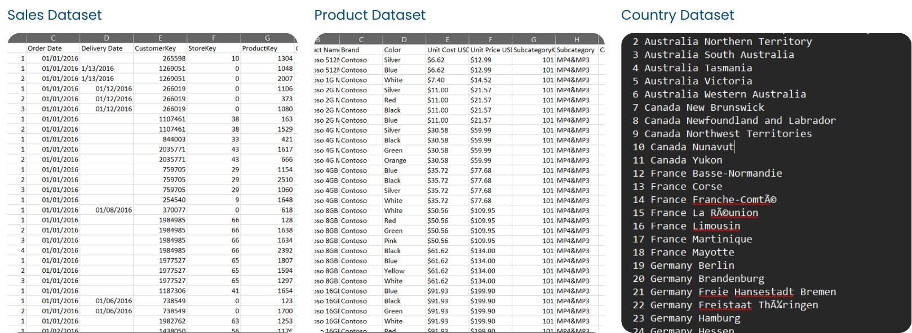
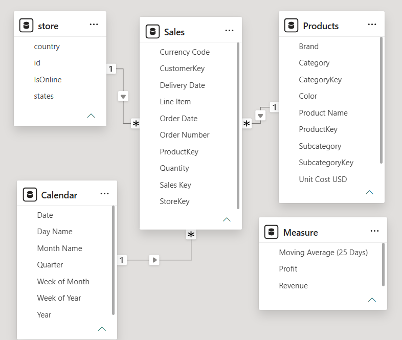

# 📊 Habnawi's Electronic, Inc. — Sales Performance Dashboard

> This project demonstrates an end-to-end **Data Analytics and Business Intelligence workflow**, starting from data preparation and data modeling to visualization and business insight generation.


---

## 1. Business Understanding
### 1.1 Business Background

**Habnawi's Electronic, Inc.** is a fictional electronics retail company specializing in the sale of various electronic products and technology devices for home, office, and entertainment needs. The company offers a wide range of product categories, such as laptops, smartphones, televisions, computers, accessories, and home appliances from various renowned brands.

Over the past few years, the company has experienced an increase in the number of transactions; however, management still lacks a comprehensive overview of the factors that contribute most significantly to the company's revenue and profit.

---

### 1.2 Bussiness Problem

Management seeks to identify top-performing product categories, the effectiveness of individual sales channels, profit trends over time, and the countries contributing the highest profits. This information is essential for supporting strategic decision-making regarding product management, marketing, market expansion, and profitability enhancement.
To address these needs, an Executive Sales Dashboard has been developed; it presents Key Performance Indicators (KPIs) and interactive visualizations, enabling management to monitor business performance rapidly and on a data-driven basis.

---

### 1.3 Project Objectives

This project aims to develop an interactive dashboard that allows stakeholders to monitor business performance and explore sales patterns through data.

The dashboard provides management-level insights into:

- Overall sales performance
- Revenue and profitability
- Product category performance
- Online vs. offline sales contribution
- Profit trends over time
- Geographic profitability
- Performance across different time periods

---

### 1.4 Bussiness Questions

1. What are the total revenue, profit, and total orders achieved by the company?
2. Which product category generates the most/least revenue?
3. How is revenue distributed across product categories?
4. What is the contribution of online sales versus offline sales to total revenue?
5. What was the trend in daily profits during the sales period?
6. Were there any specific periods that showed a significant surge or drop in profits?
7. Which country has the lowest profit performance, thereby requiring further evaluation?

---

## 2. Dataset Overview

This project uses an open source datasets that represents an electronic retail company. The datasets contains 3 main part with different file extension, Sales.csv, Product.txt, and Country.txt.



---

## 3. Tech Stack

## 4. Data Preparations

Raw data was prepared using **Power Query** in **Power BI** to ensure data quality and consistency before the analysis and visualization stages.

The data preparation process included:
- Data type validation - ensuring dates, numerical values, and categorical fields assigned appropriate data types.
- Data cleaning - identifying and handling missing, inconsistent, or invalid values.
- Column transformation - formatting and transforming existing fields to make them suitable for analysis.
- Data standardization - ensuring consistent values across categorical fields such as product categories, sales channels, and countries.
- Data validation - checking the transformed dataset to ensure that the resulting data was consistent and ready for modeling.
- Data preperation for modeling - structuring the cleaned dataset as the foundation for the subsequent data modeling and dashboard development stages.

For **Country** dataset, since it is in a .txt file without delimiters, it must first be converted using **Python** before undergoing data cleaning with **Power Query**.
This is the code to convert the **Country** dataset from .txt file to csv file:

```python
import pandas as pd

def preprocess():
    with open(file) as file:
        content = file.readlines()

    content = [line.strip() for line in content]
    content = [line.split() for line in content]

    storekeys = [line[0] for line in content][1:]

    countries = [
        " ".join(line[1:3])
        if line[1]  == "United" else line[1] 
        for line in content
        ][1:]

    states = [
        " ".join(line[3:])
        if line[1]  == "United" else " ".join(line[2:]) 
        for line in content
        ][1:]

    data = {
        "id":storekeys,
        "country": countries,
        "states": states
    }

    df = pd.DataFrame(data)
    df.to_csv("store.csv", index=False)
```

## 5. Data Modeling

The dataset was structured using a **dimensional data model** based on the **Star Schema** approach in Power BI. The model separates transactional data from descriptive attributes, allowing the dashboard to perform analysis across different business dimensions such as products, stores, and time.

The data model consists of:

- **Fact Table:** `Sales`
- **Dimension Tables:** `Products`, `Store`, and `Calendar`
- **Measure Table:** `Measure`



## 6. Data Extraction & Feature Engineering

## 7. Key Findings

## 8. Dashboard Overview

## 9. Insights & Strategic Recommendations

## 10. Limitations & Methodology Notes


---

## 🔎 Research Questions

The analysis was designed to answer the following questions:

### Overall Performance

- What are the company's total Revenue, Profit, and Orders?
- How does overall business performance change over time?

### Product Performance

- Which product categories generate the highest revenue?
- Which categories contribute the least revenue?
- How is revenue distributed across product categories?

### Sales Channel

- How much revenue is generated through Online and Offline transactions?
- What is the contribution of each sales channel to total revenue?

### Time Analysis

- How does daily profit change over time?
- Are there periods with significant increases or decreases in profit?
- How does the moving average help identify the underlying profit trend?

### Geographic Performance

- Which countries contribute the most profit?
- How is profit distributed across different countries?

---

# 🗂️ Dataset

The project uses a **dummy transactional sales dataset** created for portfolio and analytical purposes.

The dataset represents sales transactions from an electronics retail business and contains information related to:

- Orders
- Products
- Product categories
- Customers
- Sales channels
- Countries
- Order dates
- Revenue
- Cost
- Profit

> **Note:** Habnawi's Electronic, Inc. is a fictional company, and the dataset is intended for educational and portfolio purposes only.

---

# 🧹 Data Preparation

Before developing the dashboard, the raw dataset was prepared to ensure that it could be used effectively for analysis.

The data preparation process included:

### 1. Data Cleaning

- Identified and handled missing values
- Checked data types
- Reviewed duplicate records
- Standardized categorical values
- Validated date fields
- Checked numerical fields for consistency

### 2. Data Transformation

The dataset was transformed to make it suitable for analytical reporting.

Key transformations included:

- Formatting date fields
- Creating calculated fields
- Preparing analytical dimensions
- Structuring transactional data
- Preparing data for time-series analysis

### 3. Data Modeling

A dimensional modeling approach was applied to organize the dataset for analytical purposes.

The model follows the principles of a **Star Schema**, separating transactional data from descriptive dimensions.

Example structure:

```text
                    Dim Date
                       |
                       |
Dim Product ---- Fact Sales ---- Dim Customer
                       |
                       |
                 Dim Geography
                       |
                       |
                 Dim Sales Channel
